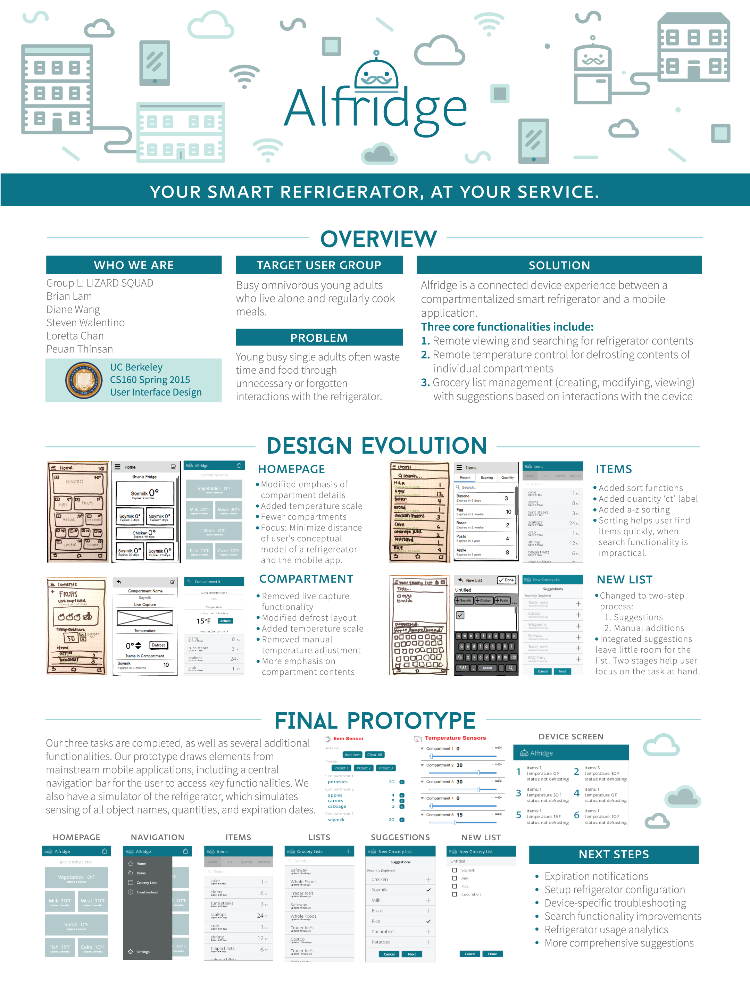

# Alfridge
#### Alfridge received runner-up best design in CS160 Spring 2015!
Alfridge is a connected device experience between a smart compartmentalized refrigerator and a mobile companion application, created over the course of the Spring 2015 semester by Group L: LIZARD SQUAD of UC Berkeley's CS160 (User Interace Design and Development) course.

##Description
Our project consists of two parts: one Kinoma Create hardware pin simulator to simulate a smart refrigerator, and the other a mobile companion application written in KinomaJS. To run the project, import both alfridge and alfridgeDevice projects into Kinoma Studio. Run alfridgeDevice using the Kinoma Create simulator, and alfridge using the mobile simulator.

Our final course video can be found [here](https://www.youtube.com/watch?v=EQvIGbh5IH0).

##Overview

